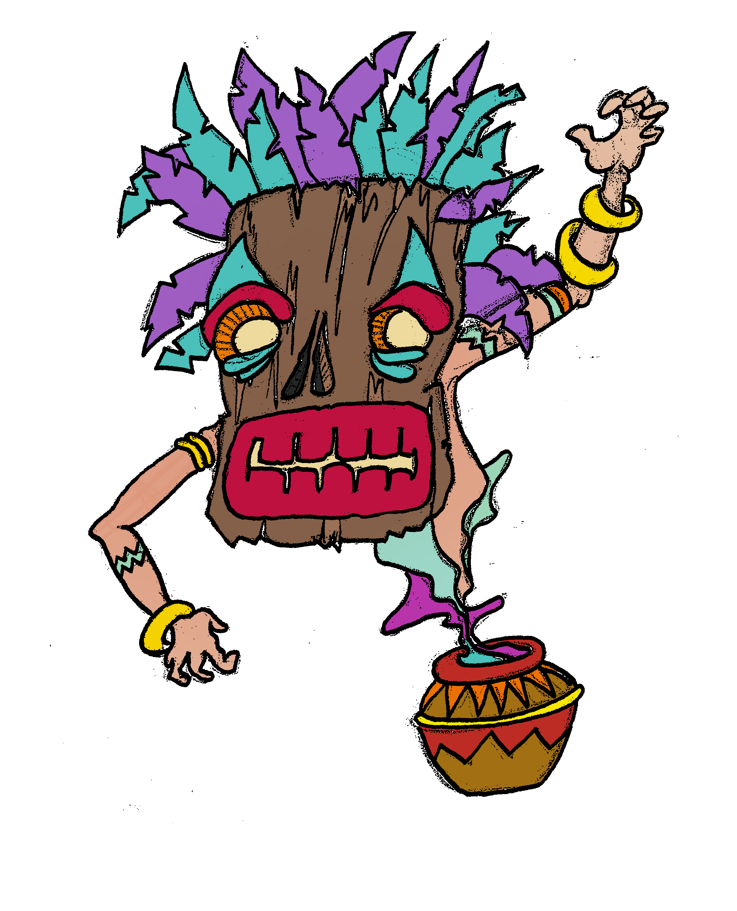

# Ghosts [](https://travis-ci.org/VampireHemophile/Ghosts)
[Ghosts](https://en.wikipedia.org/wiki/Ghosts_%28board_game%29) board game, in Java 8.



## Report
All the functionality required by the subject have been implemented successfully. There are CLI & GUI interfaces, the game is fully playable, there is a cheat mode and a read-from-file mode.

## Build & Run
This project uses [Maven](https://maven.apache.org) as its build tool.
Read [Maven in five minutes](https://maven.apache.org/guides/getting-started/maven-in-five-minutes.html) to get a quick introduction to Maven.

```sh
# build:
mvn package

# run (where $version is the project's current version):
java -jar target/Ghosts-${version}.jar
```

### Options

```
Ghosts options:
    -h --help
    --nogui
```

## Documentation
To generate the documentation and [checkstyle](http://checkstyle.sourceforge.net/) reports, run `mvn site`. Informations about the project are accessible at `target/site/index.html`, documentation of Ghosts and its tests can be found in the "Project Reports" section.  
An UML diagram can be found in `target/site/apidocs/index.html`, the root of Ghosts' documentation. You need [GraphViz](http://www.graphviz.org/) installed to generate UML diagrams.
